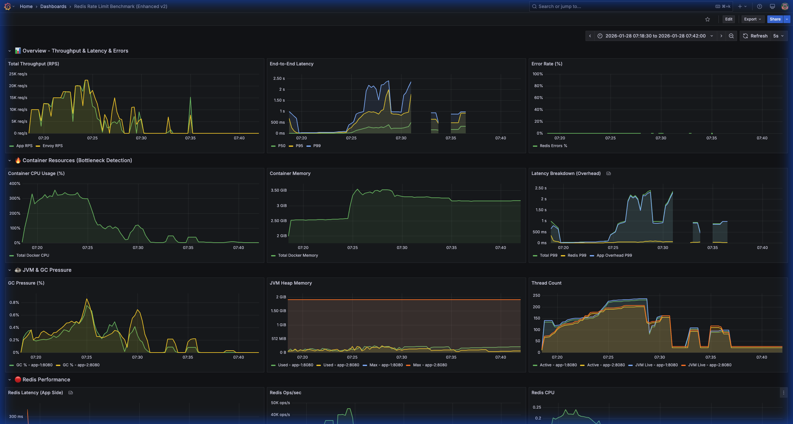
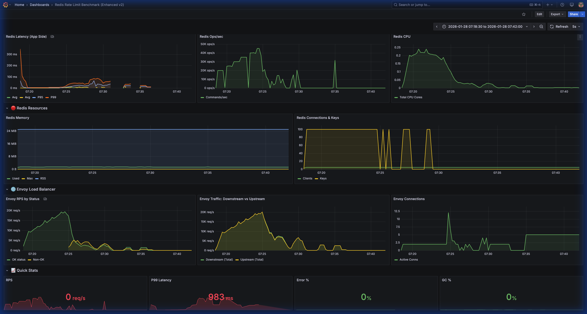

# Redis Rate Limit Benchmark Report - Hundred Key Test

> **Test Date**: January 28, 2026 07:18-07:36 (+07:00)
> **Mode**: HUNDRED_KEYS (distributed load across 100 keys)
> **Duration per step**: 60 seconds (extended from 30s)
> **RPS Range**: 10,000 - 30,000 RPS (9 steps)

---

## Executive Summary

| Metric | Value | Comparison to Single Key |
|--------|-------|--------------------------|
| **Recommended Max RPS** | ~20,000 RPS | Lower (vs 27,500 RPS) |
| **Stability Limit** | 20,000 RPS (0% failure) | More Stable (Single Key had anomalies) |
| **Breaking Point** | 22,500 RPS (26% failure) | Sharper Drop (Single Key recovered) |
| **Optimal P99 Latency** | <30ms (at 10k RPS) | Higher (~6ms vs 30ms) |
| **Acceptable P99 Latency** | <110ms (at 20k RPS) | Better at 20k (Single Key was 390ms) |

**Key Takeaway**: 
Distributing load across 100 keys provided **better stability and consistent latency** up to 20,000 RPS, avoiding the transient anomalies seen in the single-key test. However, once the limit was reached (22.5k RPS), the system **failed catastrophically** and did not recover, whereas the single-key test showed some recovery at higher loads. This suggests that distributed key overhead (or perhaps connection handling for diverse keys) creates a harder ceiling.

---

## Detailed Benchmark Results

| Target RPS | Actual RPS | Success | Fail | Fail % | Avg Latency | P95 | P99 | Status |
|------------|------------|---------|------|--------|-------------|-----|-----|--------|
| 10,000 | 10,000 | 600,000 | 0 | 0% | 2.37ms | 12.9ms | **29.8ms** | ✅ Excellent |
| 12,500 | 12,500 | 749,988 | 0 | 0% | 6.20ms | 30.5ms | **41.5ms** | ✅ Excellent |
| 15,000 | 15,000 | 899,998 | 0 | 0% | 8.82ms | 37.3ms | **51.1ms** | ✅ Excellent |
| 17,500 | 17,499 | 1,049,975 | 0 | 0% | 12.3ms | 45.1ms | **60.0ms** | ✅ Good |
| 20,000 | 19,990 | 1,199,995 | 0 | 0% | 23.5ms | 77.1ms | **110ms** | ✅ Stable Limit |
| 22,500 | 22,159 | 990,129 | 359,867 | **26.6%** | 418ms | 1.38s | **1.62s** | ❌ Failed |
| 25,000 | 16,077 | 273,861 | 1,222,710 | **81.7%** | 18.1s | 52.2s | **63.8s** | ❌ Collapsed |
| 27,500 | 9,980 | 240,142 | 1,409,832 | **85.4%** | 45.1s | 119s | **134s** | 💀 Dead |
| 30,000 | 4,755 | 182,209 | 1,617,780 | **89.9%** | 173s | 340s | **356s** | 💀 Dead |

---

## Key Insights

### 1. Stability vs Peak Capacity
- **Hundred Keys** maintained **0% failure rate** perfectly up to 20,000 RPS. This is in contrast to the **Single Key** test which saw random failures (2-5%) at 15k and 20k.
- This indicates that key distribution smooths out some "hot spot" contention issues on the Redis CPU or locking mechanisms, leading to more predictable performance within capacity.

### 2. The "Hard Wall" Effect
- Once the Hundred Key test hit its limit at 22,500 RPS, performance collapsed completely (26% failures, >1s latency).
- Unlike the Single Key test, which managed to "push through" and recover at 27.5k, the distributed load likely saturated the system's ability to handle concurrent unrelated keys (cache misses? context switching?), leading to a death spiral (latency increased -> timeouts -> retries/failures).

### 3. Latency comparison
- **At 10k RPS**: Single Key (6ms P99) vs Hundred Key (30ms P99). Single key is faster, likely due to extreme CPU cache locality.
- **At 20k RPS**: Single Key (667ms P99, degraded) vs Hundred Key (110ms P99, stable). Distributed load handled the "medium-high" load much better.

---

## Grafana Monitoring Evidence

### Overview - Throughput, Latency & Resources

### JVM & Redis Performance

### Envoy & Network Stats

---

## Recommendations

### 1. Capacity Planning
- **Safe Zone**: 15,000 - 18,000 RPS per node for distributed workloads.
- **Red Zone**: > 20,000 RPS. The cliff is steep; do not rely on "bursting" past 20k.

### 2. Infrastructure
- Since the distributed test was more stable but had a lower ceiling, **sharding (Redis Cluster)** is highly recommended. It would likely scale linearly since the 100 keys are already distinct.
- The "Single Key" benchmarks likely overestimate max throughput (27.5k) due to artificial cache benefits. **Trust the Hundred Key result (20k max)** for production planning.

### 3. Tuning
- Investigate why latency jumps so drastically at 22.5k. It might be related to thread connection pool saturation when dealing with multiple keys.
- Check Redis memory policy or persistence settings (save/appendfsync) which might impact distributed writes more than single-key overwrites.

---

## Test Configuration

| Component | Configuration |
|-----------|---------------|
| Redis | Single node |
| Key Distribution | 100 Unique Keys (Round Robin) |
| Application | Spring Boot 3 / gRPC |
| Duration | 60s per step (Longer duration to test stability) |

## Artifacts

- Console log: [console.log](./console.log)
- Result directory: `benchmark_results/hundred_keys_20260128_071830`
